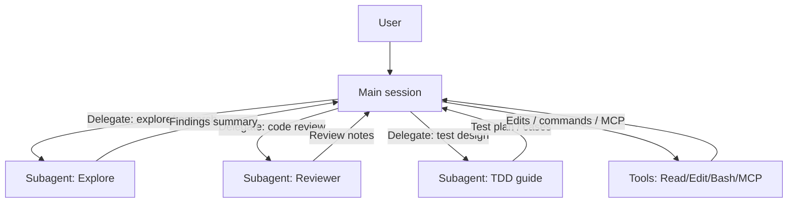
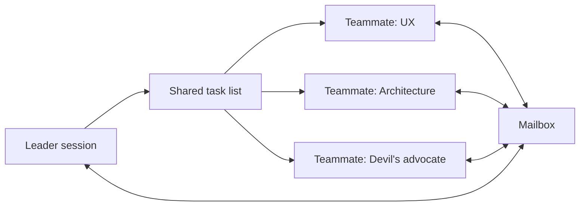
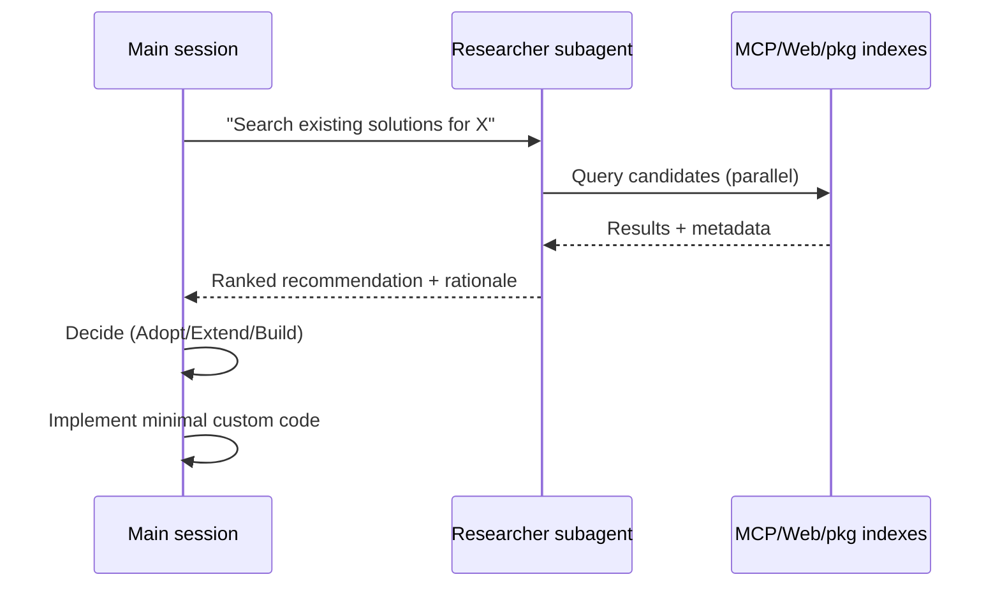
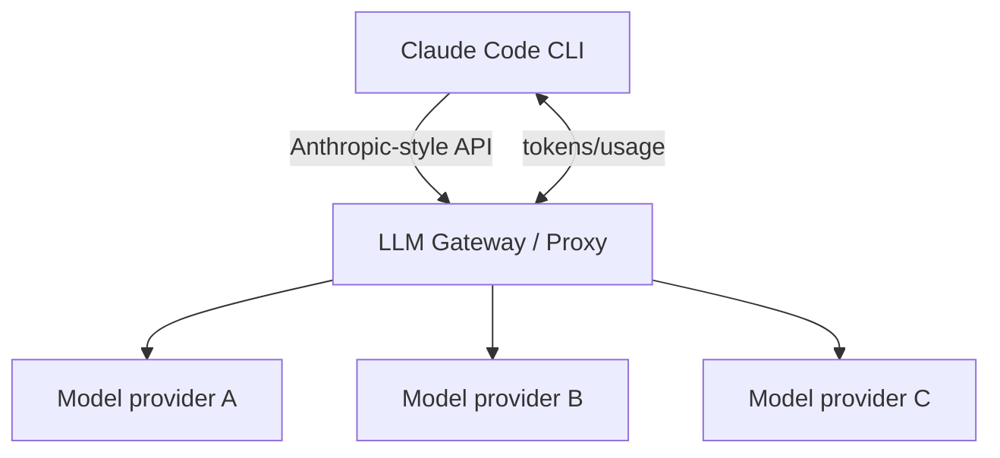

# Claude Code の実務運用に関する実例調査

## エグゼクティブサマリー

本調査は、直近5年（主に2025〜2026年）の公開情報（公式ドキュメント、公開GitHubリポジトリ、個人ブログ、企業ブログ、ハッカソン記録）から、**「実際に動くCLAUDE.md／SKILL.md／hooks／MCP設定」**に基づいて、Claude Code の実務的な使い方を抽出・比較したものです。未記載事項は「未記載」と明示し、推測は行っていません。

結論として、実務で再現性が高い運用は次の“収束点”に集まっていました。

まず、**CLAUDE.mdは“全部書く場所”ではなく“索引（インデックス）”として薄く保ち、詳細は skills / rules / planファイルに逃がす**のが、コンテキスト消費と品質低下を抑える上で合理的です。企業ブログでは、コンテキストが増えるほど注意（attention）が分散し品質が落ちる、という理屈から、Plan Mode・サブエージェント・外部ファイルへの進捗永続化を推奨しています。citeturn18view0turn23view1

次に、**マルチエージェントは「Subagents（単一セッション内）」と「Agent Teams（複数セッション間）」で設計思想が異なり、用途で明確に分けるべき**です。公式は、サブエージェントは“結果だけ返す低コスト並列”、エージェントチームは“メンバー同士が直接通信する高コスト協調”と整理し、チームサイズやタスク粒度まで具体値を示しています。citeturn21view1turn22view0turn22view2 企業の実運用検証では、**Subagents＋Git worktreeが安定、Agent Teamsは爆発力がある一方で品質が60〜70%に留まり手戻りが出やすい**という実測報告もありました。citeturn32view1

さらに、**“ハイブリッド（Claude Code × Codex × Gemini等）”は、(A) LLMゲートウェイで背後モデルを差し替える、(B) 片方をもう片方のskill/サブエージェントとして呼び出す、の2系統が主流**でした。(A)はLiteLLM等のプロキシでClaude CodeのAPI期待形に合わせて他社モデルへルーティングする方式で、手順が公開されています。citeturn33view0turn20search0 (B)は、Claude CodeのSKILL.mdから `codex exec` を呼び出す「ヘッドレスCodex」を作る実例があり、比較表まで含めた“二重レビュー”を再現できます。citeturn29view0turn31view1

最後に、**観測とガードレール（hooks・permissions・MCP統制）が品質の下支え**になります。フックイベントをHTTPへ送って可視化する“マルチエージェント観測基盤”の公開実装があり、.claudeをプロジェクトにコピーして導入できる形で示されています。citeturn32view0 一方で、MCPは強力ですが「第三者サーバーは自己責任」「プロンプトインジェクションリスク」などの注意が公式に明記されており、統制（許可/拒否、managed設定）が不可欠です。citeturn21view2turn19news38

## 調査方法とスコープ

対象は、Claude Codeの実運用に直結する「設定・手順・成果物」が公開されている資料に限定しました。特に、以下を優先しています。

公式一次情報としては、Claude Codeの設定スコープ（Managed/User/Project/Local）や、Subagents／Agent Teams／MCP／LLM gatewayの公式記述を基準点として扱いました。citeturn31view3turn21view1turn22view0turn21view2turn20search0

実務運用の“生データ”としては、公開GitHub上の **CLAUDE.md／SKILL.md／.claude設定／スラッシュコマンド／hooks** を中心に採取しました。ハッカソン上位者の公開設定集（例：everything-claude-code）と、その解説（日本語）を併用して全体像の解釈を補強しています。citeturn11view0turn13view0turn16view0turn11view1

企業での運用観点は、エンジニアブログ（Wantedly、CADDi、GMO）の実務文脈（プロジェクト構造・運用ルール・比較検証）を重視しました。citeturn17view0turn18view0turn32view1

制約として、非公開リポジトリや社内資料は対象外です。また、ソース中に人物の肩書きが明示されない場合は「未記載」としています（例：ハンドル名のみ等）。

## 実践者別ケーススタディ

以下の各ケースは、**（a）人物と所属/役割、（b）公開ソース、（c）設定断片（抜粋）、（d）使い方、（e）長所/短所、（f）再現手順**をセットで整理しています。  
引用は著作権上の制約から最小限（短い抜粋）に留め、残りは要約で補っています。

### ケース

**entity["people","Affaan Mustafa","claude code hackathon winner"]（ハッカソン優勝者）**  
役割/所属：Anthropic x Forum Ventures ハッカソン優勝（本人の職業的所属は未記載）。日本語解説では、2025年2月頃から継続利用し、2025年9月に優勝と整理されています。citeturn11view1turn11view2  
ソース：everything-claude-code（GitHub公開設定集、プラグイン/skills/hooks/rules/MCPまで包含）。citeturn11view0turn13view0turn16view0  

設定スニペット（抜粋）として、リポジトリ側CLAUDE.mdは「何のプロジェクトで、どうテストするか」を明示しています。例：`node tests/run-all.js`（全テスト実行）citeturn13view0  
skills側は、/search-first のSKILL.mdに「実装前に既存解を探索する」手順・意思決定マトリクス・サブエージェント呼び出し例（Task(...)）が記述されています。citeturn16view0  

使い方の核は、**“仮想開発チーム”としての役割分離**です。README内で、planner / code-reviewer / tdd-guide 等のエージェント、/tdd /plan /code-review 等の呼び出し、hooksによる自動化（フォーマット/品質ゲート）、MCPで外部サービス（GitHub等）に接続する流れが示されます。citeturn11view0turn11view2  
また、日本語解説では、MCPやルールを増やしすぎるとコンテキストが圧迫され、（例として）**有効トークンが200k→70kまで縮む可能性**に触れ、10個以下に抑える指針が述べられています。citeturn11view1  

長所は、（1）TDD・レビュー・セキュリティがワークフローとして“型化”される、（2）プラグイン導入で即戦力のテンプレ群が手に入る、（3）失敗モード（hooks重複等）までREADMEに明記される点です。citeturn11view0turn13view0  
短所は、（1）概念が多く導入学習コストが高い、（2）有効化しすぎるとコンテキスト/レイテンシ悪化、（3）プラグインの「rulesは配布できない」制約が明記されており手動搬入が必要、などです。citeturn11view0turn11view1  

再現手順は、READMEに「プラグインとして導入」または「手動コピー」の両ルートが示されます。概略としては、(1) repoをインストール/クローン、(2) rules/agents/skills/commandsを `~/.claude/` やプロジェクト `.claude/` にコピー、(3) hooksをsettingsへ反映、(4) MCP設定を反映、(5) /plan→/tdd→/code-reviewの順で回す、が再現単位です。citeturn11view0turn16view0

**entity["people","市古 (Sora Ichigo)","wantedly backend engineer"]（entity["company","Wantedly, Inc.","tokyo, japan"]のバックエンドエンジニア）**  
役割/所属：WantedlyのEnablingチーム、バックエンドエンジニア（本人自己紹介）。citeturn17view0  
ソース：Wantedly Engineer Blogの運用記事＋dotfiles内の `config/.claude/CLAUDE.md`（公開）。citeturn17view0turn9view0  

設定スニペット（抜粋）：`## Conversation Guidelines - 常に日本語で会話する` citeturn9view0turn17view0  

使い方の核は、**グローバル設定（~/.claude）をdotfilesで管理し、プロジェクト差分だけを局所化する**ことです。設定階層（グローバル/プロジェクト/ローカル）を整理したうえで、グローバルに「日本語」「TDD」「GitHub操作はgh優先」「既存解の優先（Context7 MCPでドキュメント参照）」などを置き、settings.jsonのpermissions.allow（許可コマンド）を育てて対話確認を減らす、という運用が説明されています。citeturn17view0turn9view0turn31view3  

長所は、（1）複数マシン/環境で同じ挙動に揃えやすい、（2）“許可リスト育成”で作業の流れが途切れにくい、（3）TDDを明文化して評価軸を固定できる点です。citeturn17view0turn9view0  
短所は、（1）グローバルに寄せすぎるとプロジェクト固有の例外が扱いづらい、（2）許可リストの設計を誤ると事故範囲が広がる、（3）設定が増えるほどコンテキスト消費が増える、などが論点になります（短所のうち具体的失敗例は未記載）。citeturn17view0turn31view3  

再現手順は、(1) dotfilesを取得、(2) `config/.claude/` を `~/.claude/` に反映、(3) `CLAUDE.md` と `settings.json` を配置、(4) `permissions.allow` を自分の安全基準に合わせて調整、が基本形です。citeturn17view0turn9view0  

**entity["people","石田 (plant)","caddi engineer"]（entity["company","CADDi","tokyo, japan"]のアプリ開発者）**  
役割/所属：CADDiでQuoteというアプリを開発、と本人が明記。citeturn18view0  
ソース：CADDi Tech Blog（コンテキストマネジメントの理論と実務Tips）。citeturn18view0turn23view0  

設定スニペット（抜粋）：Planファイルの更新方法として `Bash(ls -t -1 ~/.claude/plans/*.md | head -n 1)` を明示し、別セッションでPlanファイルを読み直して継続する手順が提示されています。citeturn18view0  

使い方の核は、**「コンテキスト＝性能」であり、性能劣化を前提に“セッション分割”と“進捗の外部化”で運用する**ことです。Plan Modeで「計画セッション」と「実装セッション」を分離し、進捗はPlanファイルに書き戻して新セッションに引き継ぐ。/rewindで“悪いコンテキストを積み上げない”。/contextでどこにトークンが使われているか可視化し、CLAUDE.mdはスリムに保ち、必要時のみファイル参照させる、という流れです。citeturn18view0turn22view2turn23view1  

長所は、（1）確率的に揺れる出力を「手順」で収束させやすい、（2）長時間セッションによる劣化を回避しやすい、（3）失敗時に巻き戻せる運用が明文化されている点です。citeturn18view0turn23view1  
短所は、（1）計画/進捗ファイル運用の手間、（2）セッションを分ける設計思想に慣れが必要、（3）機能やUIがバージョン依存で変わる可能性（記事内でも“変わりやすい”と断り）があります。citeturn18view0  

再現手順は、(1) Plan Modeで計画を作る、(2) 実装の切れ目ごとにPlanファイルへ進捗を書かせる、(3) 新セッションでPlanファイルをロードして続行、(4) /contextやrewindで劣化兆候を検知したら即切り替え、が最小セットです。citeturn18view0turn23view1  

**entity["people","H.O","gmo r&d engineer"]（entity["organization","GMOインターネットグループ","tokyo, japan"]研究開発部門）**  
役割/所属：GMOの「次世代システム研究室」として自己紹介（実名は未記載）。citeturn32view1  
ソース：Subagents と Agent Teams を実プロジェクトで比較した検証記事。citeturn32view1  

設定スニペット（抜粋）：monorepo的な構造で `project/.claude/` を共通設定として置く、と明記。citeturn32view1  

使い方の核は、**複数リポジトリ（client/server/infra）をまたぐ現実の実装タスクをClaude Codeで扱うために、設定スコープをプロジェクトルートに集約する**点です。さらに、結論として「小中規模の独立Issue群はSubagents＋Git Worktreeが安定」「Agent Teamsは40分程度で並列に進める爆発力があるが品質が60〜70%」と、用途別の現実的な評価が提示されています。citeturn32view1  

長所は、（1）“複数リポジトリ横断”という現場要件の切り方が具体的、（2）SubagentsとAgent Teamsの比較が“速度×品質”で語られ、使い分け判断に直結する点です。citeturn32view1turn22view0  
短所は、（1）Agent Teamsの品質が安定しない、（2）設定（permissions/hooks/custom agent）整備が前提で、未整備だと基礎品質が作れない、という指摘が含まれます（具体的な設定ファイル全文は未記載）。citeturn32view1  

再現手順は、(1) 複数repoを単一ルート配下に配置し `project/.claude/` を共通化、(2) 独立Issueはworktreeで分割しSubagentsで並列化、(3) 横断実装はAgent Teamsを試し、出来栄えを人が補正、という流れが記事構成上の再現単位です。citeturn32view1turn22view0  

**entity["people","Tim Warner","techtrainertim instructor"]（教育用リポジトリ運用）**  
役割/所属：GitHubの組織READMEで「Microsoft MVP、Pluralsight author、LinkedIn Learning instructor」と明記。citeturn27view0  
ソース：O’Reilly向けコース素材のリポジトリと、そのCLAUDE.md。citeturn24view0turn25search3  
（組織名としてのentity["organization","O'Reilly Media","publisher"]はコース説明上登場。citeturn24view0）

設定スニペット（抜粋）：MCPメモリサーバーの追加例として `claude mcp add memory -- npx tsx ...` が記載。citeturn24view0  

使い方の核は、**“教材としての再現性”を最優先に、検証・デモ・MCP・エージェントループをコマンド化している**点です。CLAUDE.md内に、依存導入、環境検証、セグメント別デモ（Segment 1〜3）、MCPサーバ起動やlint/format手順がまとめられています。citeturn24view0turn25search3  

長所は、（1）環境構築とデモが手順化されており再現が容易、（2）MCP・エージェント・境界（boundaries）など、業務導入で迷いやすい要素をまとめて試せる点です。citeturn24view0turn21view2  
短所は、（1）教材用途ゆえプロジェクト固有の制約への最適化は別途必要、（2）Node/Python等の前提があり軽量ではない（軽量性の評価は未記載）ことです。citeturn24view0  

再現手順は、(1) リポジトリ取得、(2) `npm install`、(3) `npm run verify`、(4) MCPサーバ起動と `claude mcp add`、(5) セグメントコマンドでワークフローを試す、が最短です。citeturn24view0turn21view2  

**entity["people","Paul Duvall","stelligent founder"]（entity["company","Stelligent","us cloud consulting"]創業者）**  
役割/所属：GitHubプロフィールで「Founded @stelligent | #AWS Community Hero | Author of Continuous Integration」と明記。citeturn26view0  
ソース：claude-code（カスタムスラッシュコマンド集）とCLAUDE.md。citeturn24view1turn25search0  

設定スニペット（抜粋）：CLAUDE.mdで方針として `Security-First` を掲げています。citeturn24view1  

使い方の核は、**「コマンド群（slash commands）でSDLC全工程を自動化し、特に防御的セキュリティと品質ゲートを前面に出す」**ことです。リポジトリ構造に、セットアップスクリプト、デプロイ、検証、hooks（ログやクレデンシャル露出防止のような用途）、さらに `/xspec` `/xtdd` `/xsecurity` 等の“流れ”が例として示されています。citeturn24view1turn25search0  

長所は、（1）“防御的”を明示して事故方向の出力を抑える設計、（2）スクリプトで配布・検証ができ、チーム展開に寄りやすい点です。citeturn24view1  
短所は、（1）コマンド体系が大きく、導入側が取捨選択しないと複雑化する、（2）「テストが落ちている状態は許容しない」といった強い制約があり、既存資産の状態によっては適用が難しい（適用困難例は未記載）ことです。citeturn24view1  

再現手順は、(1) リポジトリ取得、(2) `./setup.sh`（インストール・設定・配布）または `./deploy.sh`、(3) `./verify-setup.sh`、(4) Claude Code側で `/xhelp` を起点にワークフローを走らせる、が提示されています。citeturn24view1  

**entity["people","Aman Mittal","expo documentation writer"]（entity["company","Expo","react native platform company"]のドキュメント担当）**  
役割/所属：本人プロフィールに「software developer and technical writer」「Currently, working on documentation at Expo」と明記。citeturn29view0  
ソース：個人ブログ（Claude Code内からヘッドレスにCodex CLIを実行するskillを作成）。citeturn29view0turn31view1  

設定スニペット（抜粋）：`codex exec` を使い、`--sandbox read-only --ephemeral` を付ける点を強調。citeturn29view0  

使い方の核は、**Claude CodeをUI/セッション保存の“母艦”にし、Codex CLIを「静かに動く検査官」へ落とし込む**ことです。/run-codex skill は `AskUserQuestion` を用いてモデル・推論レベルを選ばせ、最終的に `codex exec -c ...` を走らせます。結果はCodexのレビューとClaude側のレビューを比較する形でまとめる、と記載されています。citeturn29view0turn31view2  

長所は、（1）2つのモデル/エージェントを“相互監査”に使い、片方の見落としを片方で拾える、（2）sandbox read-onlyで破壊的操作リスクを抑えてレビューに使いやすい、（3）Claude Code側にセッションを寄せて重複保存を避けられる点です。citeturn29view0turn31view1  
短所は、（1）両CLIの導入・更新が必要、（2）`codex exec` が時間を要する例（14分程度）が示されており、常用にはコスト/待ち時間の意識が必要、（3）skillに対話質問を丁寧に組まないとヘッドレス実行が破綻する点です。citeturn29view0  

再現手順は、(1) 両CLIをインストール、(2) `~/.claude/skills/run-codex/` を作りSKILL.mdで手順と質問順を定義、(3) Claude Codeで `/run-codex` を呼び出し、レビュー対象とsandbox条件を指定、(4) 出力比較を定型化、が再現単位です。citeturn29view0turn31view2  

**entity["people","disler","github user"]（マルチエージェント観測基盤の公開実装）**  
役割/所属：未記載（GitHub公開リポジトリのみ）。citeturn32view0  
ソース：claude-code-hooks-multi-agent-observability（hooksイベントを収集しダッシュボードで可視化）。citeturn32view0  

設定スニペット（抜粋）：アーキテクチャとして `Claude Agents → Hook Scripts → HTTP POST → Bun Server → SQLite → WebSocket → Vue Client` を明記。citeturn32view0  

使い方の核は、**hooksを“監査ログ/トレーシング”として扱い、複数エージェントのツール呼び出しやハンドオフを追跡する**ことです。導入は「対象プロジェクトへ `.claude` ディレクトリをコピーし、settings.jsonの識別子を更新する」手順が提示されています。さらに「OpenAI API Key（任意）でmulti-model support」という記述もあり、観測基盤側が複数モデルを扱う余地を示しています（具体的ルーティング仕様は未記載）。citeturn32view0  

長所は、（1）“エージェントが何をしたか”を後追いで検証でき、失敗分析・再現がしやすい、（2）hookイベントを中心に据えるためClaude Codeの自動化と整合しやすい点です。citeturn32view0turn19search1  
短所は、（1）ログに機密が混入し得るため運用設計が必須、（2）可視化基盤自体の運用コスト、（3）フックが不発になる不具合が報告されている場合（Pre/PostToolUse系が発火しない等）があり、依存し過ぎると観測が欠落するリスクがあります。citeturn19search21turn32view0  

再現手順は、READMEが提示する通り、(1) `.claude` をプロジェクトルートへコピー、(2) `.claude/settings.json` の識別子等を更新、(3) サーバ/クライアントを起動してダッシュボード閲覧、が基本です。citeturn32view0  

**entity["people","Boris Cherny","claude code dev"]（“Claude Code setup”として流通している運用テンプレ）**  
役割/所属：このテンプレ自体（再掲gist）内では未記載（タイトルが「Claude Code setup from Boris Cherny」）。citeturn30view0  
ソース：Artur-at-workのgist（CLAUDE.mdとして共有）。citeturn30view0  

設定スニペット（抜粋）：“Enter plan mode for ANY non-trivial task” citeturn30view0  

使い方の核は、**「計画をデフォルトにする」「サブエージェントを多用して主コンテキストを汚さない」「ユーザーから修正を受けたら lessons.md に学習を蓄積する」**という、運用メタルールの明文化です。tasks/todo.md と tasks/lessons.md を中心に、計画→実装→検証→学習のループを回す構造が提示されています。citeturn30view0turn21view1  

長所は、（1）特定言語/フレームワークに依存せず横展開できる、（2）失敗時に“止まって再計画”という安全策が明文化されている点です。citeturn30view0turn22view2  
短所は、（1）テンプレの出自・本人運用の完全一致はこの資料だけでは検証できない（未記載）、（2）具体的なpermissions/hooksなどの実装レイヤは含まれない点です。citeturn30view0  

再現手順は、(1) プロジェクトに tasks/ を作り todo.md / lessons.md を置く、(2) 非自明作業はPlan Modeから入り、必要に応じてSubagentsを投げる、(3) “完了”前にテスト/動作証明、(4) 失敗パターンはlessonsに追記し次回からルール化、が最小形です。citeturn30view0turn18view0  

## マルチエージェントとハイブリッド運用の設計

この節では、上記の実例から抽出した **「少なくとも5つ」のマルチエージェント/ハイブリッド構成**を、公式仕様と実装例に沿って整理します。図は理解補助としてMermaidで再構成しています（図そのものは本調査で作成）。

image_group{"layout":"carousel","aspect_ratio":"16:9","query":["Claude Code agent teams vs subagents diagram","Claude Code multi-agent orchestration tmux task list","Multi-Agent Observability Dashboard Claude Code","Running headless Codex CLI inside Claude Code skill screenshots"],"num_per_query":1}

### Subagentsによる階層型オーケストレーション

Subagentsは、**独立コンテキスト＋ツール制限＋独立権限**を持つ“特化ワーカー”で、メインエージェントに結果を返す形で動く、と公式に定義されています。さらに、タスクを安価なモデルへルーティングしてコストを制御できる、とも記載があります。citeturn21view1  
企業運用でも、探索（調査）を別コンテキストへ押し込み「調査結果だけをメインに戻す」ことで性能劣化を避ける、という説明があります。citeturn18view0  



実務的な“定番チェーン”は、(a) Exploreで既存実装/外部解を収集、(b) Planで実装計画、(c) TDDでテスト、(d) メインが実装、(e) Reviewerで再レビュー、という型です。everything-claude-codeは、/plan /tdd /code-review というコマンドレベルでこの流れを固定化しています。citeturn11view0turn13view0  

失敗モードは、メインが長時間セッションで劣化し、指示や規約を無視し始めることです。対策として、セッション分割（Planと実装を分ける）、外部ファイルに進捗を残して新コンテキストへ移る、/rewindで巻き戻す、が提案されています。citeturn18view0turn23view1  

評価指標は、（1）自動テストのパス率、（2）レビュー指摘の再発率、（3）1タスクあたりの編集差分量、（4）ルール逸脱回数（hooksで検出）などが、少なくとも定量化可能です（公式の標準メトリクスは未記載）。TDD色が強い設定集ではカバレッジ80%以上を要件化する記述があります。citeturn11view1turn16view0  

### Agent Teamsによる協調型オーケストレーション

Agent Teamsは、**複数のClaude Codeインスタンス（セッション）を立ち上げ、共有タスクリストとメールボックスで協調させる実験機能**です。Subagentsとの比較表として、通信・調整・トークンコストの差が公式に整理されています。citeturn22view0turn22view1  
有効化は `CLAUDE_CODE_EXPERIMENTAL_AGENT_TEAMS=1` を設定する、と明記されています。citeturn22view0  



公式の運用ベストプラクティスとして、**3〜5人から開始**し、**各メンバー5〜6タスク程度**を持たせる、という具体的な目安があります。トークンコストはメンバー数に線形に増える、調整オーバーヘッドが増える、収穫逓減がある、とも明記されています。citeturn22view2turn22view0  
また、同一ファイルを複数メンバーが編集すると上書きが起きるため、ファイル競合を避けると書かれています。citeturn22view2  

実務上の失敗モードは、企業検証では「品質が60〜70%で手戻りが出やすい」と報告されています。citeturn32view1  
対策は、(a) まず“調査・レビュー”など書き込み不要のタスクから始める、(b) タスク粒度を適正に保つ、(c) ファイル所有権を割り当てる、(d) hooksで品質ゲートを入れる、です。citeturn22view2turn19search1  

評価指標は、（1）並列化によるリードタイム短縮（タスク完了時間）、（2）競合発生回数、（3）手戻り（rework）時間、（4）差分のコンフリクト率、が現実的です（公式定義のメトリクスは未記載）。citeturn22view2turn32view1  

### コーディング前リサーチをskill化して“探索フェーズ”を固定化

everything-claude-codeの /search-first は、実装前に既存解を探すフロー・判断基準・連携ポイント（planner/architectと繋ぐ）をSKILL.mdとして定義しています。citeturn16view0turn13view0  
これは、サブエージェントへ探索を外出ししつつ（PARALLEL SEARCH）、メインは意思決定と実装に集中させる設計です。citeturn16view0turn21view1  



失敗モードは、descriptionが曖昧で意図しないskillを誤発火すること、また有効化skillが増えてメタデータだけでもコンテキストを圧迫することです（公式は「説明が曖昧だと間違ったskillをロードし得る」と述べています）。citeturn19search4turn31view2  
対策は、(a) skillを小さく保ち境界を明確にする、(b) “重要skillだけ常設し、ニッチskillは必要時に入れる”、(c) on-demandロード設計を活かす、です。citeturn31view2turn11view0  

### Claude Codeを“マルチモデル母艦化”する：LLM gateway / Proxy型

Claude Codeは、LLM gateway（プロキシ）を介して動かす設定手段を公式ドキュメントで提供しています。citeturn20search0turn20search7  
実例として、entity["people","山本暁斗","classmethod engineer"]（entity["company","クラスメソッド","tokyo, japan"]）の手順記事では、LiteLLM Proxy を挟み、`ANTHROPIC_BASE_URL`／`ANTHROPIC_AUTH_TOKEN`／`ANTHROPIC_MODEL` を環境変数で切り替えて、Claude Codeから他社モデル（例：gpt-5.2-pro）へルーティングする方法が具体的に示されています。citeturn33view0turn20search0  



失敗モードは、(a) キー漏洩（config.yamlや環境変数の扱い）、(b) 高額モデルのコスト急増、(c) 互換性ギャップ（ツール呼び出しやレスポンス形式差）です。記事では `api_key` と `master_key` をGit管理しない注意や、高額化注意が明記されています。citeturn33view0turn31view3  
対策は、(1) ルーティングは“必要時だけ”環境変数でオンにする（常用設定にしない）、(2) proxyはlocalhostバインド、(3) 目的別にモデルを切り分ける（例：探索は安価、実装は高品質）、(4) 監査ログ/観測を併設、です。citeturn33view0turn22view2  

評価指標は、（1）タスク別コスト（入力/出力トークン、proxyのメトリクス）、（2）完了率（テストパス）、（3）平均レイテンシ（proxyログ）などが適用可能です（公式の統一指標は未記載）。citeturn33view0turn22view2  

### “skillで別エージェントを呼ぶ”ヘッドレス連携：Claude Code内Codex実行

OpenAIはCodex CLIを「ローカルで動き、コードを読んで変更し、コマンド実行できる」オープンソースのコーディングエージェントとして定義し、`exec` によるスクリプト実行や、実験的マルチエージェントにも言及しています。citeturn31view0turn31view1  
Aman Mittalの実例は、Claude CodeのSKILL.mdから `codex exec` を呼ぶことで、**Claude Codeの対話UI＋Codexの別視点レビュー**を統合しています。citeturn29view0turn31view2  

失敗モードは、(a) モデル名/推論レベルの誤指定、(b) ヘッドレス実行でユーザー入力を取らず行き詰まる、(c) 二重にセッション/ログが散らばる、です。本人は初期版が誤ったモデル名だったことを明記し、AskUserQuestionで“指定を強制”する設計にしています。citeturn29view0  
対策は、(1) 選択肢をAskUserQuestionで固定化、(2) Codex側はread-only sandboxでレビューに限定、(3) 結果はClaude側でまとめ直して単一レポートにする、です。citeturn29view0turn31view1  

評価指標は、（1）二重レビューでの欠陥発見数（重複/差分）、（2）実装者の修正量削減、（3）レビュー時間、が設定可能です（本人は比較表を提示）。citeturn29view0  

## 比較分析

ここでは、実務に落とし込む際の意思決定に有用な軸で、代表ケースを横並び比較します。表の「未記載」は、ソース内に定量/定性が見当たらない項目です。

| practitioner | agents used | orchestration pattern | tools | latency/cost notes | robustness |
|---|---|---|---|---|---|
| Affaan Mustafa | エージェント群＋サブエージェント（planner等） | slash commandで工程を固定（/plan→/tdd→/review） | skills/hooks/rules/MCP | MCP等を増やすと有効トークンが縮む可能性（例示あり） | 未記載（ただし“本番環境で磨いた”趣旨の記述あり） |
| 市古 (Sora Ichigo) | 1メイン＋必要に応じて（未記載） | グローバル設定をdotfilesで統一 | CLAUDE.md/settings.json/gh/TDD | 料金面の考察あり（詳細は本文参照） | 未記載 |
| 石田 (plant) | メイン＋Explore等（言及） | セッション分割＋進捗の外部化 | Plan Mode/rewind/context | 長時間セッションは品質劣化し得る（理屈＋参照） | 未記載 |
| H.O | Subagents / Agent Teams | Issue種別で使い分け | worktree＋.claude共通化 | Agent Teamsは高負荷・品質60〜70%（本人評価） | Subagents+worktreeは安定（本人評価） |
| Tim Warner | エージェント/skills（教材） | コマンドでデモを再現 | MCP/agent loop/verify scripts | 未記載 | 未記載 |
| Paul Duvall | コマンド体系（x系）＋hooks | SDLCをコマンド化 | setup/deploy/verify + hooks | “テスト全通過必須”など強い制約 | 未記載 |
| Aman Mittal | Claude Code + Codex CLI（別エージェント） | Claude側skillがCodexをヘッドレス実行 | AskUserQuestion + codex exec | レビューに約14分の例、read-only sandbox推奨 | 2系統比較で見落とし低減（本人所感） |
| disler | 複数エージェント観測 | hooksイベントを収集/可視化 | Bun/SQLite/WebSocket/Vue | 観測基盤の運用コストは未記載 | hooks不発の既知不具合があり得る |

根拠となる要点は、各ケースと公式で次のように対応します。Agent Teamsのトークンコストや適正人数は公式で具体化されており、表の“コスト/レイテンシ”列に最も直接効きます。citeturn22view2turn22view0  
skillsについては、Codex側はprogressive disclosure（メタデータ→必要時に全文ロード）の設計が明示され、skill肥大化によるコンテキスト圧迫を抑える方向性が読み取れます。citeturn31view2turn19search4  
MCPは強力ですが、第三者サーバーの安全性は保証されない旨が公式に明記され、実際に脆弱性連鎖（RCE等）が報じられたケースもあるため、robustnessは“統制設計”に大きく依存します。citeturn21view2turn19news38  

## 再現テンプレートと推奨パターン

この節は、上記の実例から抽出した「すぐ再現できる最小セット」を、Claude Code中心に組み立てるためのテンプレです。テンプレ自体は本調査で作成したもので、個別ソースの全文転載ではありません（必要な箇所は各ソースを参照してください）。

### 推奨ディレクトリ設計

公式のスコープモデル（User/Project/Local/Managed）に沿って、次のように置くと衝突が減ります。citeturn31view3  
企業運用では、複数リポジトリを跨ぐ場合にルートへ `.claude/` を共通置きする例が報告されています。citeturn32view1  

- 個人（全プロジェクト共通）：`~/.claude/`  
- リポジトリ共有（チーム標準）：`./.claude/` または `./CLAUDE.md`  
- 個人のローカル上書き：`./.claude/settings.local.json`（gitignore推奨）citeturn31view3  

### CLAUDE.mdの最小骨子

CADDiの指針どおり、CLAUDE.mdは“索引”として薄く保ち、詳細はskillsや別ファイルに逃がすのが安全です。citeturn18view0turn23view1  

```markdown
# CLAUDE.md

## Project Overview
- このリポジトリの目的（1〜3行）
- 主要ディレクトリと責務（箇条書き少量）

## How to Build/Test
- コマンドだけを列挙（例: npm test / go test ./...）
- 成功条件（例: 全テストパス、主要lintパス）

## Rules (Index)
- 詳細は skills/ や docs/ へ誘導（例: “詳細規約は ./docs/dev-rules.md”）
- 重要な禁止事項だけ（秘密鍵、破壊的コマンドなど）
```

“運用メタルール”（Plan Modeをデフォルトにする、修正をlessonsに残す、など）はテンプレとして流通しており、必要ならtasksファイル運用とセットで導入できます。citeturn30view0turn18view0  

### skillの最小骨子

skillsは、Claude Codeでも拡張要素として説明され、Codex側ではSKILL.md＋周辺資産のディレクトリ構造と、メタデータ→全文ロードの仕組みが明記されています。citeturn19search4turn31view2  
実例として /search-first はワークフローを図式化し、意思決定マトリクスと連携ポイントまで含めています。citeturn16view0  

```markdown
---
name: my-workflow
description: いつ使うかを境界明確に（曖昧にしない）
---

# /my-workflow

## Trigger
- どういう入力のときに使うか

## Steps
1. 入力（requirements）を固定化
2. 調査はサブエージェントへ委譲（必要なら）
3. 成果物（テスト/差分/レポート）を明確に
```

### multi-agent導入時の“最低限の評価メトリクス”

公式はAgent Teamsのコストが線形に増えることを明記しているため、導入直後はまず“費用対効果”を測る必要があります。citeturn22view2turn22view0  
最小の計測セットは次です（組織やプロジェクトで調整）。

- 正確性：CIでのテストパス率、失敗→修正の平均ターン数（TDD色が強い運用ではカバレッジ要件化の例あり）citeturn11view1turn24view1  
- 速度：Issueあたりのリードタイム、エージェント並列数に対する短縮率（Agent Teamsは収穫逓減があると公式が明記）citeturn22view2  
- 手戻り：競合（同一ファイル編集）回数、巻き戻し（rewind）または再計画頻度（Plan/進捗外部化が推奨される背景）citeturn18view0turn22view2turn23view1  
- 安全性：MCP/コマンド許可範囲の監査、秘密情報混入の検知（MCPは自己責任・プロンプトインジェクション注意が公式明記）citeturn21view2turn19news38  

### 実務で推奨される“安定化パターン”

- まずSubagentsで「探索/レビュー」を分離し、メインは実装を短時間で終える（コンテキスト劣化前に切る）。citeturn21view1turn18view0turn23view1  
- Agent Teamsは、レビュー/調査など書き込み不要なタスクから導入し、タスクとファイルの所有権を明確にする。citeturn22view2turn22view0  
- hooks/permissions/MCPは“増やすほど強い”ではなく、**最小セットで回し、必要時に追加**する（過剰設定はコンテキストと安全性を悪化させ得る）。citeturn18view0turn11view1turn21view2  
- ハイブリッドは、(A) まずProxyで単一インターフェース化するか、(B) 片方をread-onlyの検査官としてskillで呼ぶ、のどちらかに寄せる。citeturn33view0turn29view0  

以上のテンプレとケースを起点に、対象プロジェクトの制約（規約、CI、セキュリティ境界、外部SaaS）をskills/rules/MCPに“差分として”落とすと、再現性の高い運用へ近づきます。citeturn31view3turn21view2turn13view0