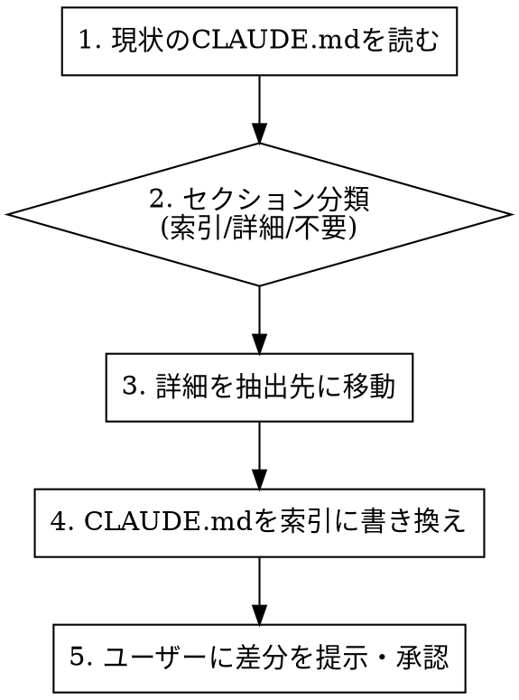

# CLAUDE.md Slimmer

CLAUDE.mdは"索引（インデックス）"として薄く保ち、詳細はdocs/やskills/に分離する。コンテキスト消費を抑え、Claudeの注意分散による品質劣化を防ぐ。

## When to Use

- プロジェクトのCLAUDE.mdが肥大化している（目安: 80行超 or 詳細な規約・手順が直書き）
- CLAUDE.mdにコードスタイル詳細、アーキテクチャ説明、ワークフロー手順が長文で埋め込まれている
- 新規プロジェクトでCLAUDE.mdの初期構造を設計したい

## When NOT to Use

- CLAUDE.mdが既にスリムで索引的（各セクション1〜3行程度）
- ユーザースコープ `~/.claude/CLAUDE.md` の編集（そちらは `revise-claude-md` を使う）
- 品質スコアリングが目的（`claude-md-improver` を使う）

## Core Principle

```
CLAUDE.md = 索引（何がどこにあるか）
docs/     = 詳細な規約・アーキテクチャ・手順
skills/   = 再利用可能なワークフロー
```

コンテキストが増えるほど注意（attention）が分散し品質が落ちる。CLAUDE.mdに直書きされた詳細は、必要時にのみ読み込まれるファイルへ移す。

## Workflow



### Step 1: 現状分析

プロジェクトルートのCLAUDE.mdを読み、各セクションを以下に分類する:

| 分類 | 基準 | 対応 |
|------|------|------|
| **索引（残す）** | プロジェクト概要、ビルド/テストコマンド、重要な禁止事項 | CLAUDE.mdに1〜3行で残す |
| **詳細（移す）** | コードスタイル規約、アーキテクチャ解説、ワークフロー手順、テスト戦略 | docs/ or skills/ に移す |
| **不要（削る）** | コードから自明な情報、git履歴で分かること、汎用的なベストプラクティス | 削除 |

### Step 2: 抽出先の決定

詳細ドキュメントの抽出先は references/extraction-rules.md を参照。概要:

| 内容の種類 | 抽出先 | ファイル名例 |
|-----------|--------|-------------|
| コードスタイル・規約 | `docs/dev-rules.md` | `docs/code-style.md` |
| アーキテクチャ解説 | `docs/architecture.md` | — |
| テスト戦略・手順 | `docs/testing.md` | — |
| 環境構築手順 | `docs/setup.md` | — |
| 再利用ワークフロー | `.claude/skills/` | `skills/deploy/SKILL.md` |
| プロジェクト固有の判断基準 | `docs/decisions.md` | — |

### Step 3: CLAUDE.mdの再構成

最小骨子テンプレート:

```markdown
# CLAUDE.md

## Project Overview
- このリポジトリの目的（1〜3行）
- 主要ディレクトリと責務（箇条書き少量）

## How to Build/Test
- `npm test` — 全テスト実行
- `npm run lint` — lint実行

## Rules
- 詳細規約 → docs/dev-rules.md
- アーキテクチャ → docs/architecture.md
- テスト戦略 → docs/testing.md

## Gotchas
- （コードから自明でない注意点のみ、各1行）
```

### Step 4: 差分提示と承認

変更を適用する前に、必ず以下を提示する:

1. **移動するセクション一覧**（元の場所 → 新ファイル）
2. **新しいCLAUDE.mdの全文**（diff形式）
3. **作成/更新するdocs/skills/ファイル一覧**

ユーザーの承認を得てから Edit/Write を実行する。

## Quick Reference: スリム化の判断

| 問い | Yes → | No → |
|------|-------|------|
| Claudeが毎回読む必要があるか？ | CLAUDE.mdに残す | 外部ファイルへ |
| 1〜3行で要点を伝えられるか？ | CLAUDE.mdに残す | 詳細を外部へ、要約を残す |
| コードやgit履歴から分かるか？ | 削除 | 残す |
| 複数プロジェクトで再利用できるか？ | skills/へ | docs/へ |

## Common Mistakes

- **移しすぎ**: ビルドコマンドや重要な禁止事項まで外部化すると、毎回参照が必要になり逆効果
- **リンク切れ**: docs/に移した後、CLAUDE.mdのポインタを更新し忘れる
- **抽出先の乱立**: docs/にファイルを作りすぎると管理が破綻する。最初は3〜5ファイルに留める
- **既存の`.claude/`構造を無視**: プロジェクトに既にrules/やskills/がある場合はそれに合わせる

## Relation to Other Skills

- **`claude-md-improver`**: 品質スコアと不足セクション追加。スリム化後の品質チェックに併用可
- **`revise-claude-md`**: セッション学習の差分追加。スリム化したCLAUDE.mdへの追記に使う
